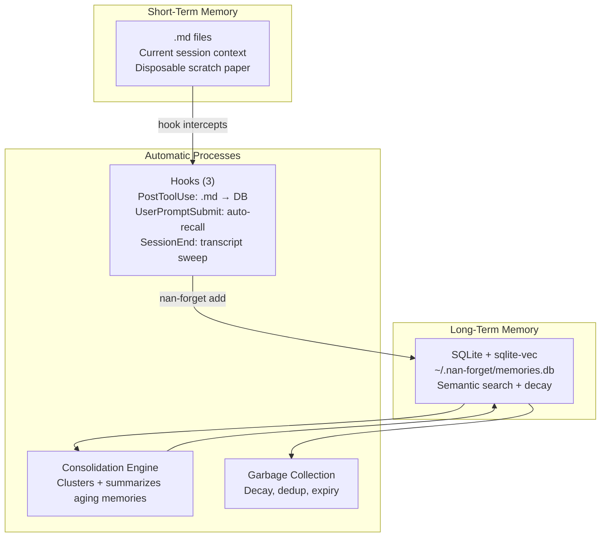
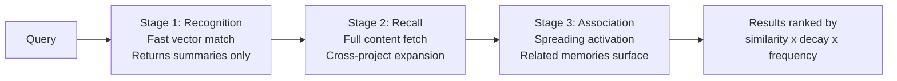
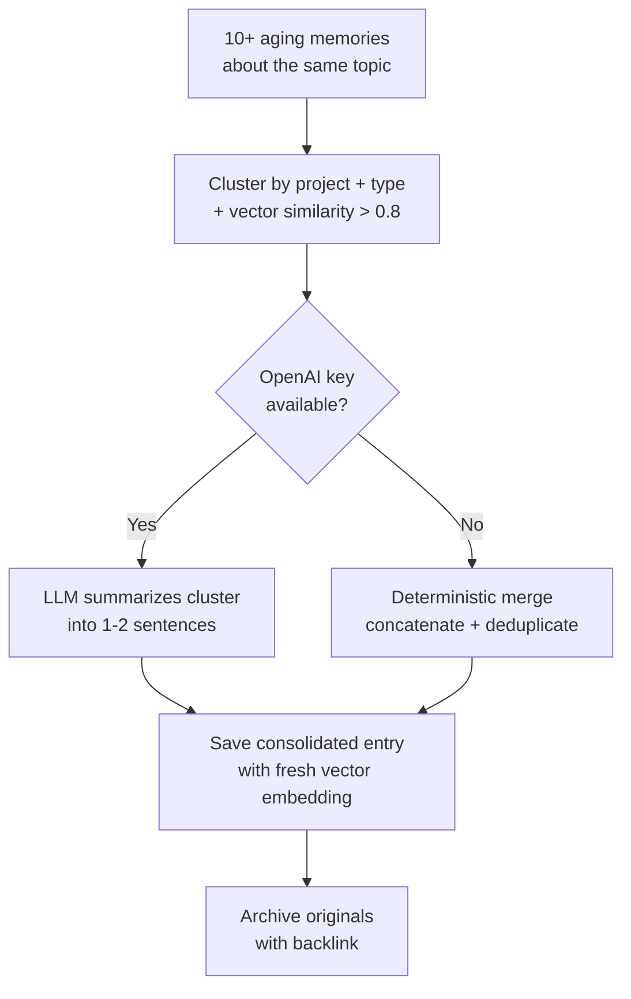

# NaN Forget

**Long-term memory for AI coding tools.**

Your AI forgets everything when the session ends. NaN Forget fixes that.

---

## Install (3 steps)

```bash
npx nan-forget setup
```

That's it. The wizard installs Ollama, embeddings, hooks, and MCP config. Restart Claude Code. Your AI now remembers.

No API keys needed. No Docker needed. Runs locally. Free forever.

---

## How It Works


1. **You work normally.** Claude saves decisions, preferences, and facts to a vector database as you go. You don't do anything.
2. **Session ends.** Memories persist in Qdrant. Aging memories get automatically compacted into long-term entries.
3. **New session starts.** Claude loads context from past sessions. Auth decisions from 3 months ago on Project A surface when you work on Project B today.

---

## Automatic Memory Handling

You never call save or search manually. Here's what happens behind the scenes:

### Claude Code (fully automatic)

| Event | What fires | What happens |
|-------|-----------|--------------|
| Session starts | `memory_sync` | Lightweight handshake — checks health, loads stats, lists projects. No heavy search. |
| You send a message | UserPromptSubmit hook | `nan-forget recall` auto-searches memory for relevant context and injects it into the conversation. |
| You discuss a topic | `memory_search` | Claude searches the DB dynamically whenever relevant context might exist — like how you recall things on-demand. |
| Claude learns something | `memory_save` | Claude saves decisions, preferences, and facts immediately. Tool descriptions tell Claude "you MUST call this." |
| Claude writes a `.md` file | PostToolUse hook | `memory-sync.js` intercepts the write, parses frontmatter, and auto-saves it to SQLite via `nan-forget add`. |
| Session ends | SessionEnd hook | `session-end.js` scans the conversation transcript for unsaved decisions/facts and saves the top 5 to the DB. |
| Every 10 saves or 24h | Auto-consolidate | Aging memories get clustered and compacted into long-term entries. Originals are archived. |

Four layers of protection ensure nothing is lost:
1. **Auto-recall on every message** (UserPromptSubmit hook)
2. **Claude saves proactively** (directive tool descriptions)
3. **Hook catches .md writes** (PostToolUse intercept)
4. **End-of-session sweep** (SessionEnd transcript scan)

### Other LLMs (Codex, Cursor, etc.)

Other LLMs don't have MCP or hooks. Instead:

1. **Get the system prompt**: `nan-forget prompt` or `GET /memories/instructions`
2. **Paste it into your LLM's system prompt**. It tells the LLM to call the REST API for save/search/sync.
3. **The LLM calls the REST API** at `localhost:3456` during conversation.

The REST API mirrors the MCP tools. Same database, same retrieval pipeline, same consolidation. Memories saved by Claude are searchable from Codex and vice versa.

```bash
# Start the REST API
nan-forget api

# The system prompt tells your LLM exactly what endpoints to call
nan-forget prompt
```

---

## Slash Commands

Type these in Claude Code:

| Command | What it does |
|---------|-------------|
| `/nan-forget` | Load context from past sessions |
| `/nan-forget stats` | Show memory health |
| `/nan-forget clean` | Run garbage collection |
| `/nan-forget compact` | Force memory consolidation |
| `/nan-forget health` | Check if services are running |
| `/nan-forget start` | Start all services |

---

## Works with Any LLM

Claude uses MCP. Other LLMs use the REST API:

```bash
# Start the API
nan-forget api

# Get the system prompt for your LLM
nan-forget prompt
```

Paste the system prompt into Codex, Cursor, or any LLM. They share the same memory database.

```bash
curl http://localhost:3456/memories/search?q=auth
curl -X POST http://localhost:3456/memories/sync -d '{"project":"my-app"}'
```

---

## Quick Start (CLI)

```bash
nan-forget add "We use FastAPI, not Django. Railway deploys faster."
nan-forget add --type decision "Auth is Clerk, not custom JWT"
nan-forget search "what auth system"
nan-forget stats
```

---

# Architecture (Expert Section)

Everything below is for developers who want to understand how nan-forget works under the hood.

---

## The Problem

LLMs have no memory between sessions. Every conversation starts from zero. You re-explain your stack, Claude contradicts decisions from last month, and context disappears when the session ends.

Existing solutions (Mem0) target app developers embedding memory into products. We target you — the developer using AI tools daily who wants AI that just remembers.

## Design: Brain-Inspired Two-Layer Memory



**Short-term memory** = Claude's built-in `.md` files. Disposable. Current session only.

**Long-term memory** = SQLite database with sqlite-vec vector search. Single file. Permanent. Searchable across all sessions, all projects, all LLM tools.

Three hooks handle memory automatically:
- **PostToolUse** intercepts `.md` file writes and saves them to the DB.
- **UserPromptSubmit** runs `nan-forget recall` on every user message, auto-searching memory for relevant context.
- **SessionEnd** scans the conversation transcript for unsaved decisions and saves the top 5.

## Three-Stage Retrieval Pipeline

Memory search follows the same path as human recall:



| Stage | What happens | Cost |
|-------|-------------|------|
| **Recognition** (blur) | Prefetch 50 candidates, return top 5 summaries. Cheap. | 1 vector search |
| **Recall** (clarity) | Fetch full content. Expand search cross-project (no project filter). | N point lookups |
| **Association** | Qdrant `recommend()` API. Spreading activation from positive IDs. | 1 recommend call |

**Scoring formula:**

```
final_score = vector_similarity * decay_weight * frequency_boost
decay_weight = 0.5 ^ (days_since_accessed / 30)
frequency_boost = log2(access_count + 1) / 10 + 1
```

Unused memories fade on a 30-day half-life. Frequent access keeps them sharp. Cross-project search means auth decisions from Project A surface when you work on Project B.

## Consolidation Engine

Aging memories don't just get deleted — they get compacted into long-term entries:



**Triggers automatically** after every 10 saves or 24 hours. No user action needed.

## 13 MCP Tools

| Tool | Purpose |
|------|---------|
| `memory_sync` | Lightweight session handshake: health check + stats + project list |
| `memory_save` | Save a memory (auto-called by Claude, proactively) |
| `memory_search` | Semantic search with 3-stage retrieval (depth 1-3) |
| `memory_get` | Fetch a specific memory by ID |
| `memory_update` | Change content, type, or tags |
| `memory_archive` | Soft-delete (hidden from search, never truly deleted) |
| `memory_consolidate` | Force consolidation of aging memories |
| `memory_clean` | Garbage collection (decay, dedup, expiry, MEMORY.md sync) |
| `memory_stats` | Memory health dashboard |
| `memory_health` | Check if Ollama, REST API are running |
| `memory_start` | Boot Ollama + REST API |
| `memory_checkpoint` | Save full problem→solution context after completing a task |
| `memory_compress` | Compress persisted `.md` memory files to minimal stubs |

## Structured Memories

`memory_save` accepts structured fields for richer vector representation:

| Field | Type | Purpose |
|-------|------|---------|
| `content` | string | Full description (required) |
| `type` | string | `fact`, `decision`, `preference`, `task`, `context` |
| `project` | string | Project name |
| `problem` | string | What was the challenge |
| `solution` | string | How it was solved |
| `concepts` | string[] | Searchable tags (`["auth", "jwt", "middleware"]`) |
| `files` | string[] | Files involved (`["src/auth.ts"]`) |

All fields are embedded together into a single vector. Searches for "JWT auth bug" find memories tagged with those concepts even if the content text doesn't match literally.

### Checkpoint Workflow

After completing a task, call `memory_checkpoint` with `task_summary`, `problem`, `solution`, `files`, `concepts`, and `project`. Saves the full problem→solution context to long-term memory. Every completed task = one checkpoint.

### Memory Compression

`memory_compress` scans `.claude/projects/*/memory/` for `.md` files already persisted to the DB. Persisted files are replaced with minimal stubs. Reduces context window bloat.

## REST API (for non-MCP LLMs)

Shares the same SQLite database as the MCP server — memories saved by Claude are searchable from Codex and vice versa.

```
POST   /memories              — Save a memory
POST   /memories/sync         — All-in-one context loader
GET    /memories/search?q=... — Semantic search
GET    /memories/:id          — Get by ID
PATCH  /memories/:id          — Update
DELETE /memories/:id          — Archive
POST   /memories/consolidate  — Compact aging memories
POST   /memories/clean        — Garbage collection
GET    /memories/stats        — Memory health
GET    /memories/instructions — System prompt for LLMs
```

Get the system prompt for any LLM:

```bash
nan-forget prompt
# or
curl http://localhost:3456/memories/instructions
```

## Embeddings

| Provider | Model | Dimensions | Cost |
|----------|-------|-----------|------|
| Ollama (default) | nomic-embed-text | 768 | Free, local |
| OpenAI | text-embedding-3-small | 1536 | Your API key |

Auto-detection: Ollama running? Use it. Not running? Check for `OPENAI_API_KEY`. No config needed.

## Data Storage

All data lives in a single SQLite file at `~/.nan-forget/memories.db`. No Docker, no services, no data loss on updates.

- **Vector search**: [sqlite-vec](https://github.com/asg017/sqlite-vec) extension (cosine distance, embedded in process)
- **Metadata**: Standard SQL tables with indexes on `user_id`, `status`, `project`, `type`
- **Backup**: Copy one file. **Restore**: Put it back.

## Memory Lifecycle


## Garbage Collection (Zero LLM Cost)

All cleanup is deterministic. No API calls. No LLM inference.

- **Decay GC**: Archives memories below 0.1 decay (~100 days untouched)
- **Expiration**: Archives memories past `expires_at` date
- **Interference resolution**: Deduplicates >0.95 similarity matches, keeps higher access count
- **MEMORY.md sync**: Refreshes working memory with top 5 scored memories per project

## Design Philosophy

NaN Forget is built around three principles: **lightweight**, **automatic**, and **local**.

### Lightweight

No Docker. No cloud services. No background processes eating RAM. The entire storage layer is a single SQLite file (~3 MB). Embeddings run through Ollama, which you likely already have. Memory operations (save, search, dedup, GC) use zero LLM calls — all deterministic.

### Automatic

Four hooks capture context at every stage of a session — you never call save manually:

1. **UserPromptSubmit** searches memory on every message you send
2. **Tool descriptions** instruct Claude to save decisions and facts as they happen
3. **PostToolUse** intercepts `.md` file writes and persists them
4. **SessionEnd** sweeps the transcript for anything missed

Aging memories consolidate automatically. Duplicates merge. Unused memories decay on a 30-day half-life. No maintenance required.

### Local

Your data stays on your machine in `~/.nan-forget/memories.db`. No accounts, no API keys required (Ollama is free and local), no telemetry. Backup is copying one file. Works across Claude Code (MCP), Codex/Cursor (REST API), and the terminal (CLI) — same database, same memories.

### How it differs from other memory tools

Most AI memory solutions (Mem0, claude-mem) are designed for app developers embedding memory into products, or require Docker/cloud services to run. NaN Forget is designed for **you** — the developer using AI tools daily who wants context that persists across sessions without managing infrastructure.

Key design differences:

- **Retrieval**: Three-stage pipeline (recognition → recall → spreading activation) with decay-weighted scoring, rather than flat vector search
- **Structure**: Memories carry `problem`, `solution`, `concepts`, and `files` fields — searches find related context even when keywords don't match
- **Cost**: Memory operations (save, search, dedup, consolidation, GC) are all deterministic — no LLM calls, no API costs
- **Setup**: One command (`npx nan-forget setup`), no Docker, no containers, no services to manage

## Source Structure

```
src/
  sqlite.ts         SQLite + sqlite-vec storage layer (schema, CRUD, vector search)
  embeddings.ts     OpenAI / Ollama abstraction
  writer.ts         Memory writer with dedup (>0.92 = merge)
  retriever.ts      Three-stage retrieval pipeline
  consolidator.ts   LLM summarization + deterministic fallback
  cleaner.ts        GC: decay, expiry, dedup, MEMORY.md sync
  services.ts       Service management (Ollama, REST API)
  memory-md.ts      MEMORY.md manager
  types.ts          Shared types (Memory, MemoryType, etc.)
  mcp/server.ts     MCP server, 13 tools
  api/server.ts     REST API server, 10 endpoints
  cli/index.ts      CLI with 14 commands
  setup/index.ts    Setup wizard (Ollama, hooks, MCP config)

.claude/
  commands/nan-forget.md   Slash command for manual control
  hooks/memory-sync.js     PostToolUse hook (auto-saves .md → SQLite)
  hooks/session-end.js     SessionEnd hook (transcript sweep for unsaved memories)
  settings.json            Hook config (PostToolUse + SessionEnd + UserPromptSubmit)
```

---

## Built by NaN Logic LLC

- [NaN Mesh](https://nanmesh.ai) — trust network for AI agents
- **NaN Forget** — long-term memory for any LLM

MIT License.
