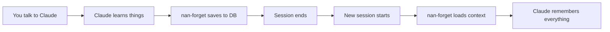
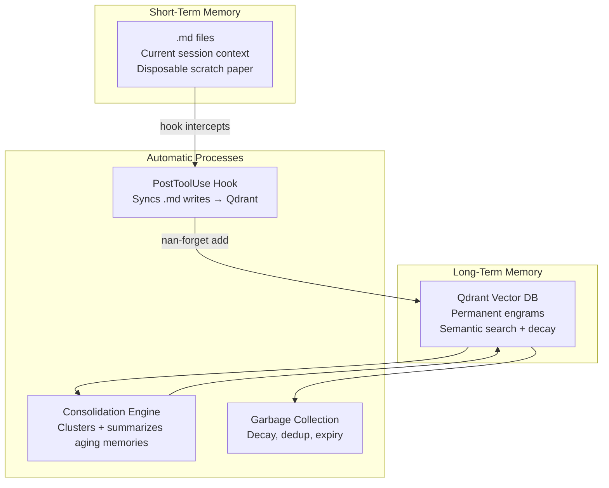
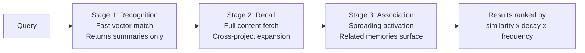
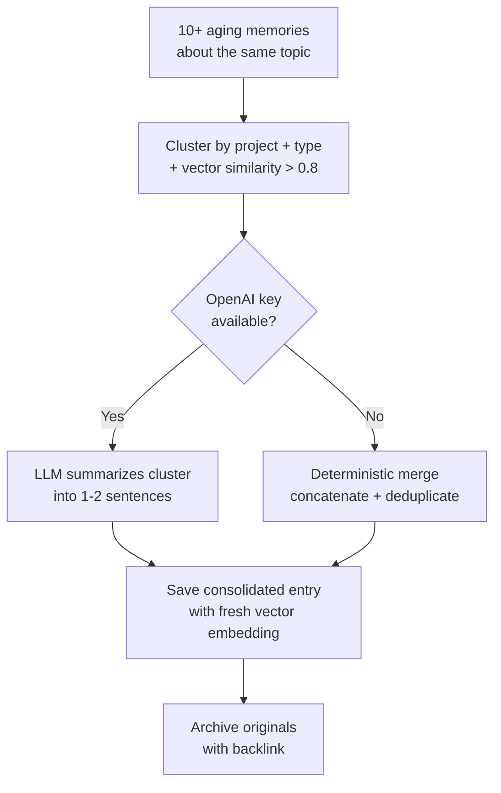
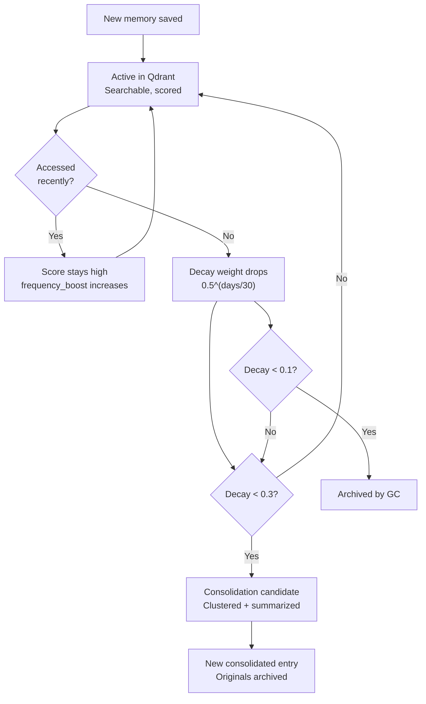

# NaN Forget

**Long-term memory for AI coding tools.**

Your AI forgets everything when the session ends. NaN Forget fixes that.

---

## Install (3 steps)

```bash
npx nan-forget setup
```

That's it. The wizard installs Docker, Qdrant, embeddings, hooks, and MCP config. Restart Claude Code. Your AI now remembers.

No API keys needed. Runs locally. Free forever.

---

## How It Works



1. **You work normally.** Claude saves decisions, preferences, and facts to a vector database as you go. You don't do anything.
2. **Session ends.** Memories persist in Qdrant. Aging memories get automatically compacted into long-term entries.
3. **New session starts.** Claude loads context from past sessions. Auth decisions from 3 months ago on Project A surface when you work on Project B today.

---

## Slash Commands

Type these in Claude Code:

| Command | What it does |
|---------|-------------|
| `/nan-forget` | Load context from past sessions |
| `/nan-forget stats` | Show memory health |
| `/nan-forget clean` | Run garbage collection |
| `/nan-forget compact` | Force memory consolidation |
| `/nan-forget health` | Check if services are running |
| `/nan-forget start` | Start all services |

---

## Works with Any LLM

Claude uses MCP. Other LLMs use the REST API:

```bash
# Start the API
nan-forget api

# Get the system prompt for your LLM
nan-forget prompt
```

Paste the system prompt into Codex, Cursor, or any LLM. They share the same memory database.

```bash
curl http://localhost:3456/memories/search?q=auth
curl -X POST http://localhost:3456/memories/sync -d '{"project":"my-app"}'
```

---

## Quick Start (CLI)

```bash
nan-forget add "We use FastAPI, not Django. Railway deploys faster."
nan-forget add --type decision "Auth is Clerk, not custom JWT"
nan-forget search "what auth system"
nan-forget stats
```

---

# Architecture (Expert Section)

Everything below is for developers who want to understand how nan-forget works under the hood.

---

## The Problem

LLMs have no memory between sessions. Every conversation starts from zero. You re-explain your stack, Claude contradicts decisions from last month, and context disappears when the session ends.

Existing solutions (Mem0) target app developers embedding memory into products. We target you — the developer using AI tools daily who wants AI that just remembers.

## Design: Brain-Inspired Two-Layer Memory



**Short-term memory** = Claude's built-in `.md` files. Disposable. Current session only.

**Long-term memory** = Qdrant vector database. Permanent. Searchable across all sessions, all projects, all LLM tools.

A PostToolUse hook intercepts every `.md` memory file Claude writes and automatically saves it to Qdrant. The user never calls save manually.

## Three-Stage Retrieval Pipeline

Memory search follows the same path as human recall:



| Stage | What happens | Cost |
|-------|-------------|------|
| **Recognition** (blur) | Prefetch 50 candidates, return top 5 summaries. Cheap. | 1 vector search |
| **Recall** (clarity) | Fetch full content. Expand search cross-project (no project filter). | N point lookups |
| **Association** | Qdrant `recommend()` API. Spreading activation from positive IDs. | 1 recommend call |

**Scoring formula:**

```
final_score = vector_similarity * decay_weight * frequency_boost
decay_weight = 0.5 ^ (days_since_accessed / 30)
frequency_boost = log2(access_count + 1) / 10 + 1
```

Unused memories fade on a 30-day half-life. Frequent access keeps them sharp. Cross-project search means auth decisions from Project A surface when you work on Project B.

## Consolidation Engine

Aging memories don't just get deleted — they get compacted into long-term entries:



**Triggers automatically** after every 10 saves or 24 hours. No user action needed.

## 11 MCP Tools

| Tool | Purpose |
|------|---------|
| `memory_sync` | All-in-one session start: load context + check health + consolidate |
| `memory_save` | Save a memory (auto-called by Claude, proactively) |
| `memory_search` | Semantic search with 3-stage retrieval (depth 1-3) |
| `memory_get` | Fetch a specific memory by ID |
| `memory_update` | Change content, type, or tags |
| `memory_archive` | Soft-delete (hidden from search, never truly deleted) |
| `memory_consolidate` | Force consolidation of aging memories |
| `memory_clean` | Garbage collection (decay, dedup, expiry, MEMORY.md sync) |
| `memory_stats` | Memory health dashboard |
| `memory_health` | Check if Qdrant, Ollama, REST API are running |
| `memory_start` | Boot all services |

## REST API (for non-MCP LLMs)

```
POST   /memories              — Save a memory
POST   /memories/sync         — All-in-one context loader
GET    /memories/search?q=... — Semantic search
GET    /memories/:id          — Get by ID
PATCH  /memories/:id          — Update
DELETE /memories/:id          — Archive
POST   /memories/consolidate  — Compact aging memories
POST   /memories/clean        — Garbage collection
GET    /memories/stats        — Memory health
GET    /memories/instructions — System prompt for LLMs
```

Get the system prompt for any LLM:

```bash
nan-forget prompt
# or
curl http://localhost:3456/memories/instructions
```

## Embeddings

| Provider | Model | Dimensions | Cost |
|----------|-------|-----------|------|
| Ollama (default) | nomic-embed-text | 768 | Free, local |
| OpenAI | text-embedding-3-small | 1536 | Your API key |

Auto-detection: Ollama running? Use it. Not running? Check for `OPENAI_API_KEY`. No config needed.

## Memory Lifecycle



## Garbage Collection (Zero LLM Cost)

All cleanup is deterministic. No API calls. No LLM inference.

- **Decay GC**: Archives memories below 0.1 decay (~100 days untouched)
- **Expiration**: Archives memories past `expires_at` date
- **Interference resolution**: Deduplicates >0.95 similarity matches, keeps higher access count
- **MEMORY.md sync**: Refreshes working memory with top 10 scored memories per project

## Comparison with Mem0

|  | Mem0 | NaN Forget |
|--|------|-----------|
| Target | App developers | Individual developers using AI daily |
| Runs locally | Cloud-first | Fully local by default |
| MCP integration | Generic | Claude Code hooks + MCP + REST API |
| LLM cost for memory ops | Yes (extraction, summarization) | Zero (deterministic cleaner) |
| Cross-LLM | No | Yes (MCP for Claude, REST API for Codex/Cursor) |
| Auto-save | No | Yes (PostToolUse hook) |
| Auto-consolidation | No | Yes (after 10 saves or 24h) |
| Setup | Complex self-host | One command: `npx nan-forget setup` |
| Free tier | 10K memories | Unlimited |
| Data ownership | Cloud default | Yours |

## Source Structure

```
src/
  qdrant.ts         Qdrant client wrapper + schema + indexes
  embeddings.ts     OpenAI / Ollama abstraction
  writer.ts         Memory writer with dedup (>0.92 = merge)
  retriever.ts      Three-stage retrieval pipeline
  consolidator.ts   LLM summarization + deterministic fallback
  cleaner.ts        GC: decay, expiry, dedup, MEMORY.md sync
  services.ts       Service management (health checks, starters)
  memory-md.ts      MEMORY.md manager
  types.ts          Shared types (Memory, MemoryType, etc.)
  mcp/server.ts     MCP server, 11 tools
  api/server.ts     REST API server, 10 endpoints
  cli/index.ts      CLI with 14 commands
  setup/index.ts    Setup wizard (Docker, Ollama, hooks, MCP config)

.claude/
  commands/nan-forget.md   Slash command for manual control
  hooks/memory-sync.js     PostToolUse hook (auto-saves .md → Qdrant)
  settings.json            Hook configuration
```

---

## Built by NaN Logic LLC

- [NaN Mesh](https://nanmesh.ai) — trust network for AI agents
- **NaN Forget** — long-term memory for any LLM

MIT License.
